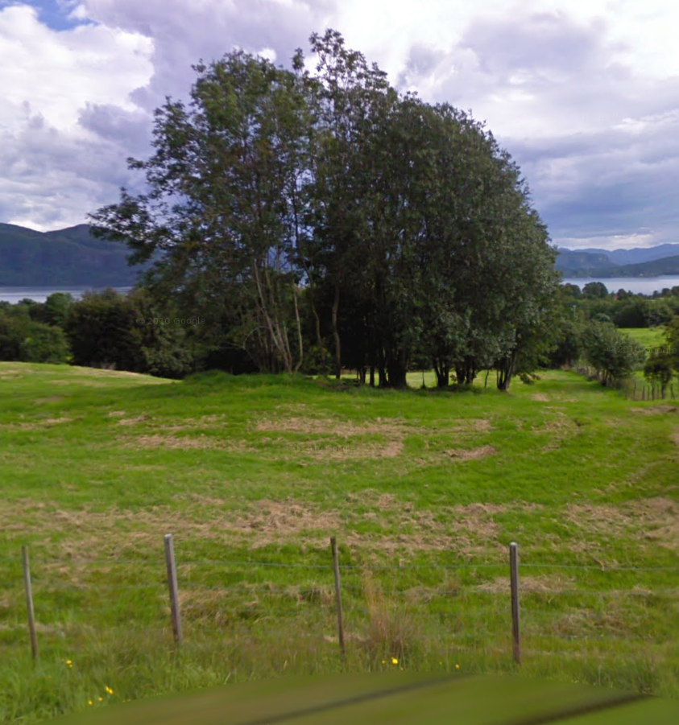
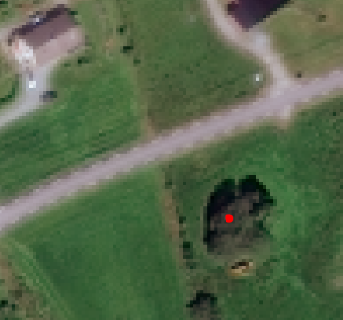
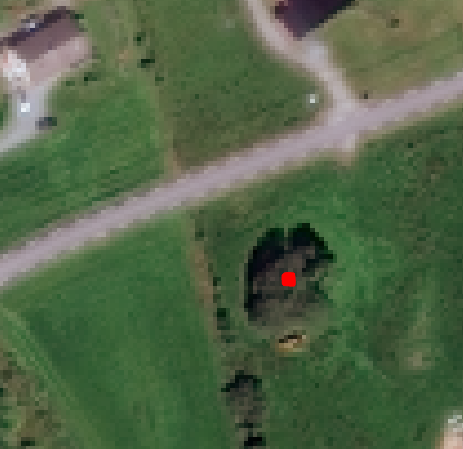
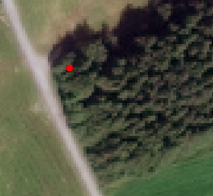
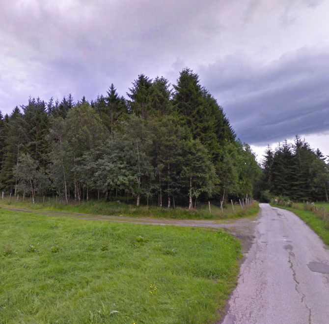

# Comparing Adjacent LiDAR Pixel Within "Tree Scene"

Points within this "tree cell" show varying heights from ground height up to 11m above ground. Most cells show close to ground height

This pixel show height value equal to **ground elevation**.

This pixel show tree height is **11m**

# Comparing LiDAR Pixels To DTM Pixels

- DTM show heights between 35-36m ***above sea level***. 
- LiDAR show heights between 36-55m (*up to 19m above ground*) within tree scene. 
- The pixels below show a height of 45m (*~10m above ground*) 

Google Street View of scene

# LiDAR Points In A Single Pixel

Some of these points seem to reflect above sea level values from  
- ground
- mid-canopy 
- **top of canopy**  

